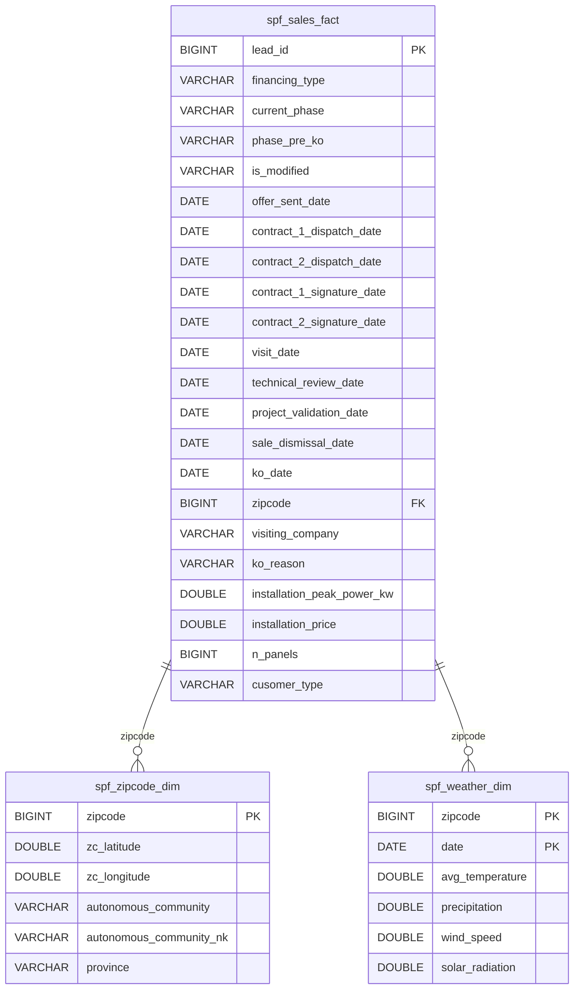

# Big Data & Analytics '26

# Data Management for BI

# Final Assignment

By:
Omar Ahmed

## Data Model Design

### Overview

The data warehouse for this project follows a **star schema** design. At the centre sits a single fact table — `spf_sales_fact` — which captures every lead and its journey through the solar panel sales funnel. Two dimension tables — `spf_zipcode_dim` and `spf_weather_dim` — extend that central table with geographic and meteorological context via a shared `zipcode` key.

---

### Schema Diagram

---

### Why a Star Schema?

The raw source data arrives as a flat file (`sale_phases_funnel.csv`) with every attribute crammed into a single row per lead. A star schema was chosen to restructure this for analytical use for the following reasons.

**Query simplicity.** A star schema exposes clean, denormalised dimensions. Business questions like "what is the average installation price per province?" can be answered with a single JOIN between the fact table and the zipcode dimension, rather than navigating a complex web of normalised tables.

**BI tool compatibility.** Tools like Metabase, Tableau, or Power BI are built around the concept of a fact table joined to dimensions. A star schema maps directly to how those tools define metrics and groupings, meaning less configuration overhead.

**Performance.** Because the dimensions are denormalised, there are fewer joins at query time. On a dataset of ~35,000 leads this is not a bottleneck today, but it is the right foundation if the data grows significantly.

**Separation of concerns.** Keeping geographic data in `spf_zipcode_dim` and weather data in `spf_weather_dim` means that if the source CSVs for either of those are updated independently, only the relevant dimension table needs to be reloaded. The fact table is untouched.

---

### Primary / Foreign Key Summary

| Table             | Primary Key       | Foreign Key                                                                 |
| ----------------- | ----------------- | --------------------------------------------------------------------------- | --- |
| `spf_sales_fact`  | `lead_id`         | `zipcode` → `spf_sales_fact.zipcode` \ `zipcode` → `spf_sales_fact.zipcode` |
| `spf_zipcode_dim` | `zipcode`         |                                                                             |
| `spf_weather_dim` | `(zipcode, date)` |                                                                             | --- |

### Naming Convention

All tables follow the convention `spf_{name}_{type}` where:

- `spf_` is the project prefix (sales phases funnel)
- `_fact` denotes the central fact table
- `_dim` denotes a dimension table

---

### Relationship Notes

The relationship between `spf_sales_fact` and `spf_weather_dim` is worth clarifying. While both tables share a `zipcode` column, there is no direct foreign key enforced in MySQL between them — the join is performed analytically at query time by matching `zipcode` and a chosen date column (e.g. `visit_date`).
The `zipcode` in the `spf_zipcode_dim`is also not related to the `zipcode` in`spf_weather_dim` this is to avoid a circular relationship in the model.

---

---

## Cleaning Operations

For the cleaning operations, it would be simpler to go through each table and the cleaning methods used, and the justification for these data transformations.

---

### spf_sales_fact

Cleaning operations applied:

1. Standardise column names to lowercase.
2. Remove duplicate leads (same lead_id appearing more than once).
3. Impute missing installation_peak_power_kw
4. Validate categorical fields financing_type and visiting_company
5. Parse all date columns to proper datetime types
6. Strip leading/trailing whitespace from string columns

The cleaning operations are a mix of standard data quality checks (dedupe, snakecase column names, removing whitespace, assign data types) with table specific data quality checks (impute and replace null values, validate categorical fields)

---

### spf_zipcode_dim

Cleaning operations applied:

1. Standardise column names to lowercase.
2. Remove rows where ZIPCODE is null – it is the primary key.
3. Remove duplicate zip codes (keep first occurrence).
4. Strip whitespace from string columns

For the zipcode table, the cleaning operations are mostly standard data quality checks - removing duplicates, stripping whitespace, and standardized column names.
The only table specific DQ check is for the nulls in the primary key, which will be dropped in this case to avoid any problems in query joins.

---

### spf_weather_dim

Cleaning operations applied:

1. Standardise column names to lowercase.
2. Parse the date column to proper datetime type.
3. Remove rows where both zipcode and date are null - primary keys couple
4. Remove exact duplicate rows

For the weather table, the cleaning operations are mostly standard data quality checks - removing duplicates, assigning date type, and standardized column names.
The only table specific DQ check is for the nulls in the primary key couple of date + zipcode, which will be dropped in this case to avoid any problems in query joins.

---

---

## Index Selection

---

A quick explanation of the indexes chosen for this data model and pipeline.
